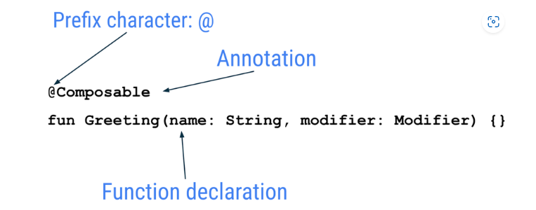
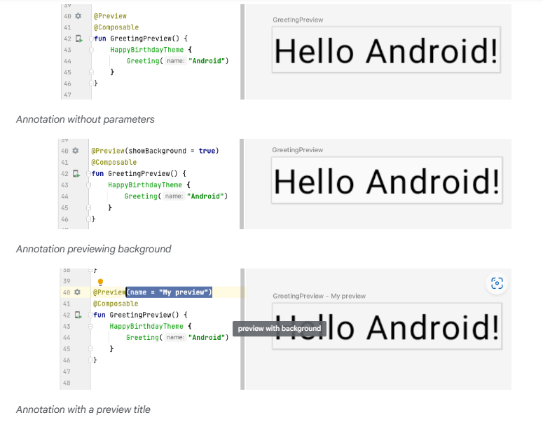
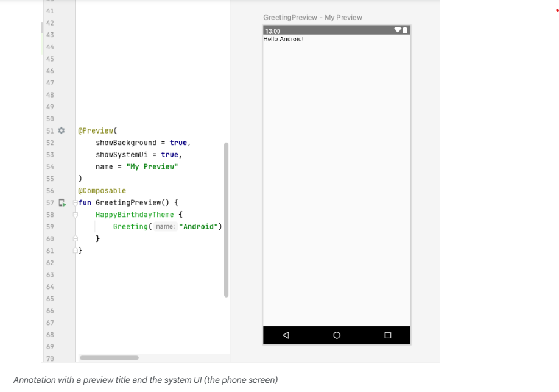
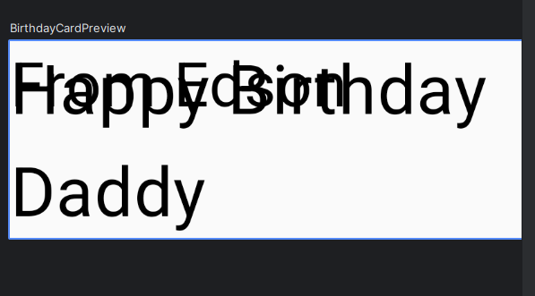

# Jetpack Compose
Jetpack Compose is a modern toolkit for building Android UIs. Compose simplifies and accelerates UI development on Android with less code, powerful tools, and intuitive Kotlin capabilities. With Compose, you can build your UI by defining a set of functions, called composable functions, that take in data and describe UI elements.

# Composable functions
Composable functions are the basic building block of a UI in Compose. A composable function:
- Describes some part of your UI.
- Doesn't return anything.
- Takes some input and generates what's shown on the screen.

# Annotations
Annotations are means of attaching extra information to code. This information helps tools like the Jetpack Compose compiler, and other developers understand the app's code.

An annotation is applied by prefixing its name (the annotation) with the @ character at the beginning of the declaration you are annotating. Different code elements, including properties, functions, and classes, can be annotated.



## Annotations with parameters
Annotations can take parameters. Parameters provide extra information to the tools processing them. 

The following are some examples of the @Preview annotation with and without parameters.



You can pass multiple arguments to the annotation, as shown here. 👇



## Example of a composable function
The Composable function is annotated with the @Composable annotation. All composable functions must have this annotation. This annotation informs the Compose compiler that this function is intended to convert data into UI. As a reminder, a compiler is a special program that takes the code you wrote, looks at it line by line, and translates it into something the computer can understand (machine language).

This code snippet is an example of a simple composable function that is passed data (the name function parameter) and uses it to render a text element on the screen.

```kotlin
@Composable
fun Greeting(name: String) {
    Text(text = "Hello $name!")
}
```

A few notes about the composable function:

- Jetpack Compose is built around composable functions. These functions let you define your app's UI programmatically by describing how it should look, rather than focusing on the process of the UI's construction. To create a composable function, just add the @Composable annotation to the function name.
- Composable functions can accept arguments, which let the app logic describe or modify the UI. In this case, your UI element accepts a String so that it can greet the user by name.

## Notice the composable functions in code
In Android Studio, open the `MainActivity.kt` file.
Scroll to the `GreetingPreview()` function. This composable function helps preview the `Greeting()` function. As a good practice, functions should always be named or renamed to describe their functionality. Change the name of this function to `BirthdayCardPreview()`.

```kotlin
@Preview(showBackground = true)
@Composable
fun BirthdayCardPreview() {
    HappyBirthdayTheme {
        Greeting("Android")
    }
}
```

Composable functions can call other composable functions. In this code snippet, the preview function is calling the `Greeting()` composable function.

Notice the previous function also has another annotation, a `@Preview` annotation, with a parameter before the `@Composable` annotation.

## Composable function names
The compose function that returns nothing and bears the @Composable annotation MUST be named using Pascal case. Pascal case refers to a naming convention in which the first letter of each word in a compound word is capitalized. The difference between Pascal case and camel case is that all words in Pascal case are capitalized. In camel case, the first word can be in either case.

**The Compose function:**

- MUST be a noun: DoneButton()
- NOT a verb or verb phrase: DrawTextField()
- NOT a nouned preposition: TextFieldWithLink()
- NOT an adjective: Bright()
- NOT an adverb: Outside()
- Nouns MAY be prefixed by descriptive adjectives: RoundIcon()
- To learn more see [Naming Composable functions](https://github.com/androidx/androidx/blob/androidx-main/compose/docs/compose-api-guidelines.md#naming-unit-composable-functions-as-entities).

_Example code. Do not copy over_

```kotlin
// Do: This function is a descriptive PascalCased noun as a visual UI element
@Composable
fun FancyButton(text: String) {}


// Do: This function is a descriptive PascalCased noun as a non-visual element
// with presence in the composition
@Composable
fun BackButtonHandler() {}


// Don't: This function is a noun but is not PascalCased!
@Composable
fun fancyButton(text: String) {}


// Don't: This function is PascalCased but is not a noun!
@Composable
fun RenderFancyButton(text: String) {}


// Don't: This function is neither PascalCased nor a noun!
@Composable
fun drawProfileImage(image: ImageAsset) {}
```

# Scalable pixels
The scalable pixels (SP) is a unit of measure for the font size. UI elements in Android apps use two different units of measurement: density-independent pixels (DP), which you use later for the layout, and scalable pixels (SP). By default, the SP unit is the same size as the DP unit, but it resizes based on the user's preferred text size under phone settings.

```kotlin
Text(
    text = message,
    fontSize = 100.sp
)
```

>[!Note]
>A composable function might describe several UI elements. However, if you don't provide guidance on how to arrange them, Compose might arrange the elements in a way that you don't like. For example, the previous code generates two text elements that overlap each other because there's no guidance on how to arrange the two composables.



# Arrange text elements in Rows and Columns
[Article Link](https://developer.android.com/codelabs/basic-android-kotlin-compose-text-composables?continue=https%3A%2F%2Fdeveloper.android.com%2Fcourses%2Fpathways%2Fandroid-basics-compose-unit-1-pathway-3%23codelab-https%3A%2F%2Fdeveloper.android.com%2Fcodelabs%2Fbasic-android-kotlin-compose-text-composables#7)

# Summary
- Jetpack Compose is a modern toolkit for building Android UI. Jetpack Compose simplifies and accelerates UI development on Android with less code, powerful tools, and intuitive Kotlin APIs.
- The user interface (UI) of an app is what you see on the screen: text, images, buttons, and many other types of elements.
- Composable functions are the basic building block of Compose. A composable function is a function that describes some part of your UI.
- The Composable function is annotated with the @Composable annotation; this annotation informs the Compose compiler that this function is intended to convert data into UI.
- The three basic standard layout elements in Compose are Column, Row, and Box. They are Composable functions that take Composable content, so you can place items inside. For example, each child within a Row will be placed horizontally next to each other.